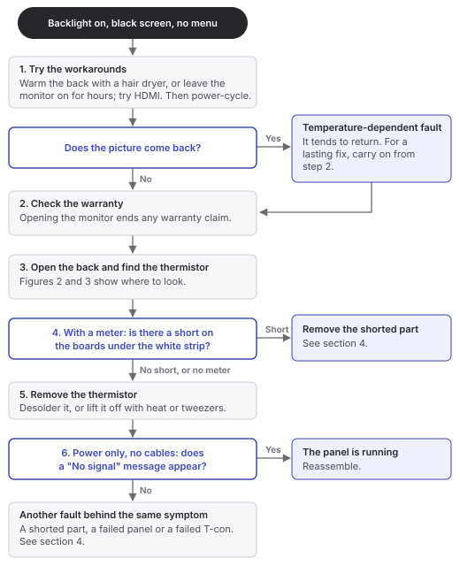
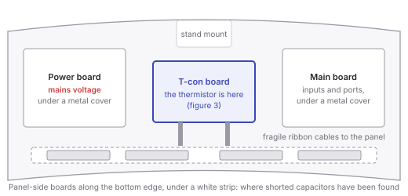
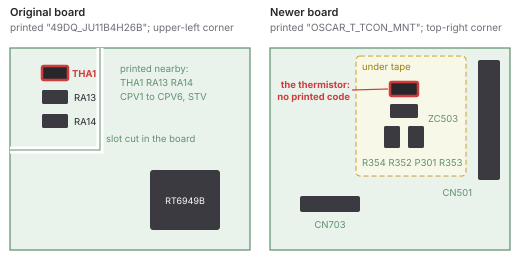
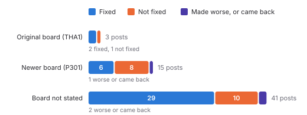
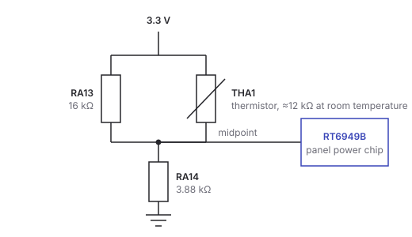
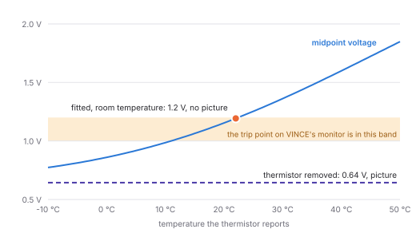

## Start here {#section-1}

If your Odyssey G9 or Neo G9 lights up but shows nothing

<ul>
<li><strong>You are not alone.</strong> The backlight comes on, the screen stays black and the menu will not open, often after the monitor has been unplugged for days. Owners have described the same fault in <a href="https://www.reddit.com/r/widescreengamingforum/comments/10r8w19/">one Reddit thread</a> since 2023 and in <a href="https://www.reddit.com/r/AskElectronics/comments/1dyi62v/">another</a> since 2024.</li>
<li><strong>Try the free workarounds first.</strong> Warming the monitor or leaving it on for hours brought the picture back for 7 owners in those two threads. These need no tools and do not open the monitor.</li>
<li><strong>The common lasting fix is removing one tiny part,</strong> a thermistor on the T-con board. In the two Reddit threads this report started from, 37 of 59 owners who removed it say it fixed their monitor.</li>
<li><strong>It does not always work,</strong> because the same black screen has other causes: a shorted capacitor, a failed panel or a failed T-con board.</li>
</ul>

<strong>To fix your monitor,</strong> read <a href="#section-2">sections 1 to 5</a>, starting with the flowchart in <a href="#section-3">section 2</a>. <strong>To understand why it happens,</strong> read <a href="#section-7">sections 6 and 7</a>. <a href="#section-9">Section 8</a> covers what Samsung has published, and <a href="#section-10">section 9</a> how you can help settle the open question.

## 1. Is this your fault? {#section-2}

This report covers the Samsung Odyssey G9 (model C49G95T, 2020) and the Odyssey Neo G9 (S49AG95, 2021). Your monitor probably has this fault if all of these are true:

- The power light and the backlight come on, but the screen stays black.
- The menu button does nothing, so not even the on-screen menu appears.
- The computer can still detect the monitor ([u/Deep_Audience_4234][deepaudience], [u/SivitriExMachina][sivitri]).
- It started after the monitor was off or unplugged for a while: a holiday of six days ([u/crossivejoker][crossivejoker]), a week and a half ([u/JaredWyns][jared]) or two weeks ([u/alphanimal][alphanimal-2weeks]) in reports.

Before it becomes permanent the fault can come and go: [u/Mystfit][mystfit] had to power-cycle the monitor up to 20 times to get a picture, and [u/crossivejoker][crossivejoker] lived with it for years.

Two cases from the thread that started this report:

- **u/djbkwon's original G9** went black after a holiday, and also went black whenever it was switched to 240&nbsp;Hz. Removing the thermistor fixed both ([comment][djbkwon-fix]), and it has worked for two years since ([comment][djbkwon-2years]).
- **u/JaredWyns's Neo G9**, made in January 2022, was unpowered for about a week and a half. Since then it shows black lines briefly at power-on, then a black screen with no menu. Its T-con is marked BN95-08081A, does not look like the board in the repair guides, and showed no visible thermistor ([comment][jared]). [Section 3](#section-4) shows where it is on that board.

Other models, including the 57-inch Neo G9, the OLED G9, the G7 and the CRG9, use different boards that this report does not cover.

## 2. What to try, in order {#section-3}

<figure class="tall">

<figcaption><b>Figure 1.</b> What to try, in order. Each step is explained below.</figcaption>
</figure>

**Step 1: the workarounds.** Warm the back of the monitor with a hair dryer from a distance, keeping it moving, for a few minutes ([u/AmaDeusen-][amadeusen]), or leave it powered on for hours or days ([u/liluzivat][liluzivat], [u/mdebak7][mdebak7]); then power-cycle it. Connecting another computer by HDMI has also brought the picture back ([u/catsnstuffz][catsnstuffz], [u/XSomeLoser][xsomeloser]). If warming works, your fault depends on temperature, which points to the thermistor rather than a short or a dead panel. It can come back the next time the monitor cools.

**Step 2: the warranty.** Opening the monitor ends any warranty claim. In Korea, Samsung repairs the panel free for two years, longer than its general monitor warranty ([Samsung Korea][warranty-kr]); the UK gives 24 months ([Samsung UK][warranty-uk]) and Germany two or three years depending on the model ([Samsung Germany][warranty-de]).

**Step 3: open the back.** Unplug the monitor and wait several minutes. The T-con board sits in the middle of the back (figure 2). [Section 3](#section-4) shows how to tell which T-con you have and where its thermistor is.

**Step 4: check for a short,** if you have a multimeter. Lift the white strip along the bottom edge of the panel and test the capacitors on the small boards there for a short to ground. Four owners found a shorted part there after thermistor removal had done nothing ([Console Hub][consolehub], [u/TenantLord][tenantlord], [u/EnoughAttention8070][enoughattention], [u/No-Set2959][noset]).

**Step 5: remove the thermistor.** Owners have desoldered it ([u/alphanimal][alphanimal-post]), loosened it with a heat gun ([u/Xenocop][xenocop]) or worked it off with tweezers ([u/soarer25][soarer25]). Brush away any loose solder afterwards.

**Step 6: test before reassembling.** Connect only the power cable. A "No signal" message means the panel is running ([u/_sarcasme][sarcasme]). If the screen stays black, [section 4](#section-5) lists the other faults.

**Safety.** The power board carries mains voltage and large capacitors, so unplug the monitor and wait before touching anything. The ribbon cables between the T-con and the panel, and the panel itself, are fragile: [u/MovinggunTV][movinggun] damaged the panel while unclipping the back cover. Everything here is at your own risk.

## 3. Finding the thermistor {#section-4}

<figure>

<figcaption><b>Figure 2.</b> The back of an original G9 with the cover off, drawn from <a href="https://www.reddit.com/r/AskElectronics/comments/1dyi62v/">u/alphanimal's photo</a>. On the Neo G9 the T-con can sit under a metal bracket in the middle (<a href="https://www.reddit.com/r/AskElectronics/comments/1dyi62v/comment/mbqbw4m/">u/Ok-Entrance-7481</a>).</figcaption>
</figure>

There are two T-con designs in these monitors ([Samsung parts data][enc-g9-ca02]). The words printed on the board tell you which one you have.

**The original board** is printed "49DQ_JU11B4H26B_V03_HF" along its bottom edge ([photo][photo-g9board]). Its thermistor, THA1, is the top one of three small parts on a corner tab that a slot separates from the rest of the board, with RA13 and RA14 below it ([photo][photo-tha1], [u/alphanimal][alphanimal-post]).

**The newer board** is printed "OSCAR_T_TCON_MNT" and "BN41-02934A" ([photo][photo-sticker]). It is used in later original G9s and in the Neo G9, where its sticker reads BN95-08081A ([appendix](#section-12)). Its thermistor, P301, is under the tape at the top right: beside the printed label ZC503 and above connector CN703 is a column of four small parts, and the thermistor is the one with no printed code ([photo][photo-p301]). Owners of this board in [the r/AskElectronics thread][thread-ae] could not find it until [u/OccasionalBrat][occasionalbrat] linked that photo and [added that it was under tape][occasionalbrat-tape].

<figure>

<figcaption><b>Figure 3.</b> Where the thermistor is on each board, drawn for this report; not to scale. Photos: <a href="https://imgur.com/a/iPrctlF">original board</a>, <a href="https://imgur.com/a/eLgQIAK">its thermistor corner</a>, <a href="https://imgur.com/a/O24GMny">newer board</a>, <a href="https://imgur.com/a/BxBGHTp">its thermistor corner</a>.</figcaption>
</figure>

**To confirm you have the right part,** measure it out of circuit. A healthy one reads about 10 to 12&nbsp;kΩ on the original board ([u/alphanimal][alphanimal-post], [VINCE][vince-ntc]) and about 28 to 33&nbsp;kΩ on the newer board, where Samsung lists a 33&nbsp;kΩ part ([parts data][enc-neo-cc03]) and [u/Emotional-Amount-954][emotional] read 28&nbsp;kΩ on a removed one.

[u/JaredWyns][jared-240v] noticed that their Neo G9 is labelled as a 240&nbsp;V model although it has run for four years on 120&nbsp;V. That points to a universal-input supply; the input rating on the back label says which.

## 4. If removing it did not help {#section-5}

The same black screen has at least four documented causes. Each one stops the supply that powers the panel, so they look identical from the outside.

Table: **Table 1.** Faults documented behind the black screen.

| Fault | What fixed it | Reports |
|---|---|---|
| Thermistor trip | Removing the thermistor | 37 of the 59 owners in figure 4 |
| Shorted capacitor on a panel-side board, under the white strip | Removing the capacitor | Eight: [1][morten], [2][consolehub], [3][tenantlord], [4][enoughattention], [5][climatepretty], [6][iwenzo], [7][noset], [8][seoul-short]; in 2, 3, 4 and 7 the thermistor had been removed first |
| Failed panel | A new panel | Three: Samsung technicians [in Germany][cornflex] and [in Korea][dcinside] after a new main board had not helped, and [one in the Philippines][fonglutz] |
| Failed T-con | A new T-con | Three: a Seoul repair shop's [two][seoul-warm] [G9s][seoul-tcon], one of which worked only when warm, and [a CRG9][crg9-tcon] |

**If you have a meter,** the short is the cheapest to find. The panel-side boards are the strip along the bottom of figure 2.

**A new T-con often does not help.** Nine owners of 49-inch models report that a replacement T-con changed nothing ([1][eastdev], [2][boostedv3], [3][rattlemebones], [4][ventrex], [5][redadties], [6][stavsss], [7][opxxl], [8][bloodgroup], [9][extraattention]), including the person who first found the thermistor. Three of them also replaced the main board and power supply, with no change ([1][extraattention], [2][rattlemebones], [3][ventrex]). A replacement board may carry the same drifted parts; the reports do not say.

**The panel is the expensive case.** Owners report quotes of €800 for the display unit ([u/Levikus][levikus]), €1,000 for the panel ([u/Sblombliz][sblombliz]) and $2,300 for the main board and screen ([u/Elfthis][elfthis]).

## 5. What owners report after removing it {#section-6}

<figure>

<figcaption><b>Figure 4.</b> Every owner in <a href="https://www.reddit.com/r/AskElectronics/comments/1dyi62v/">the r/AskElectronics thread</a> and <a href="https://www.reddit.com/r/widescreengamingforum/comments/10r8w19/">the r/widescreengamingforum thread</a> who reports removing the thermistor, read in full on 6 October 2026, by the board each names. Each owner counts once, whether they wrote the opening post or a comment; all but one are comments. A board counts as named only when the owner names the part or points to a photo of it. These are counts of reports, not a measured success rate.</figcaption>
</figure>

Of the 59 owners, 37 report a fix, 19 no change, 2 a worse result and 1 a fault that came back. Only 15 of them name the board: on the newer board, removal fixed 6 monitors and did not fix 8; on the original board, it fixed 2 and did not fix 1. Two of the failures were later fixed by removing a shorted part ([1][noset], [2][tenantlord]).

**How long it lasts.** Five owners give a time for which removal has held: six months ([u/pboksz][pboksz], [u/webjocky][webjocky]), about a year ([u/CommunityJazzlike512][communityjazz]), at least a year ([u/NSXelrate][nsxelrate]) and two years ([u/djbkwon][djbkwon-2years]). Three report the fault returning: after one day ([u/roughmind79][roughmind]), after about six months ([u/MntyFresh1][mntyfresh]), and in May after a fault the previous August ([u/cootersmooches][cootersmooches]).

**What can go wrong.** [u/mkonowaluk][mkonowaluk] saw flashing lines down the screen after removal, and [u/samurai_sed][samurai] broke the part and the monitor then had no power. No report describes a monitor run for long with the part replaced by a new thermistor.

**What removal costs is not known.** Depending on what the thermistor input actually does ([section 7](#section-8)), a monitor without it either drives the panel's gate transistors harder at all temperatures, which panel makers' patents associate with more leakage ([BOE, US10553176B2][patent-leak]) and with stress on those transistors ([BOE, US10984879B2][patent-stress]), or runs without one protection input. Keeping the vents clear is the only practical precaution.

## 6. Why it happens: the thermistor circuit {#section-7}

### The circuit

On the original board the thermistor is part of a voltage divider ([u/alphanimal's schematic][alphanimal-post]). The upper leg is resistor RA13 in parallel with the thermistor THA1, fed from the 3.3&nbsp;V supply; the lower leg is RA14 to ground. The midpoint goes to a Richtek RT6949B, the chip that powers and clocks the panel's gate drivers. The repair YouTuber [My Mate VINCE][vince] traced the midpoint to that chip ([19:34][vince-chip]) and measured the parts.

<figure class="narrow">

<figcaption><b>Figure 5.</b> The thermistor divider on the original G9 T-con, with the values <a href="https://www.youtube.com/watch?v=Cz4uRrf5JXc&amp;t=3594s">VINCE measured</a>. A colder thermistor has higher resistance, so the midpoint voltage falls as the board cools.</figcaption>
</figure>

### What the measurements show

Table: **Table 2.** The divider midpoint on one failing original G9, measured by [My Mate VINCE][vince].

| Condition | Midpoint | Picture |
|---|---|---|
| Thermistor fitted, about 12&nbsp;kΩ at room temperature | 1.2&nbsp;V ([49:05][vince-12v]) | No |
| Thermistor removed | 0.64&nbsp;V ([53:14][vince-064v]) | Yes ([38:29][vince-works]) |
| Thermistor refitted | 1.2&nbsp;V | No ([44:05][vince-refit]) |
| Thermistor fitted, divider resistors changed to 10&nbsp;kΩ and 2.2&nbsp;kΩ | about 1.0&nbsp;V ([78:55][vince-10v]) | Yes ([82:01][vince-10v-works]) |

The measured resistances reproduce both measured voltages: 0.64&nbsp;V without the thermistor and 1.19&nbsp;V with a 12&nbsp;kΩ thermistor (my calculation from [VINCE's readings][vince-resistors]). [u/alphanimal][alphanimal-13v], who first published the removal, measured 1.3&nbsp;V on their own failing monitor. Cooling the thermistor alone with an ice pack also brought that picture back for a while ([post][alphanimal-post]), and [u/East_Development_126][eastdev], who first found the part, narrowed it down by cooling one area of the board at a time with compressed air.

The thermistor itself is not broken in the four cases where it was measured: [u/alphanimal][alphanimal-post] read 10&nbsp;kΩ just after removing it, [VINCE][vince-ntc] about 12&nbsp;kΩ at room temperature and 11&nbsp;kΩ warm, and [u/Emotional-Amount-954][emotional] 28&nbsp;kΩ on a removed P301, about right for a 33&nbsp;kΩ part at 28&nbsp;°C. [u/Sblombliz][sblombliz] found that the sensor's resistance changed smoothly with temperature.

### The trip point

<figure>

<figcaption><b>Figure 6.</b> The midpoint voltage on VINCE's divider against the temperature the thermistor reports (my calculation, assuming the thermistor reads 12&nbsp;kΩ at 22&nbsp;°C with a typical B&nbsp;=&nbsp;3950&nbsp;K curve). The board failed at 1.2&nbsp;V and worked at 1.0&nbsp;V and at 0.64&nbsp;V.</figcaption>
</figure>

On VINCE's monitor the board failed at 1.2&nbsp;V and worked at 1.0&nbsp;V and below, so it has a trip point between those two voltages. On this divider, 1.2&nbsp;V corresponds to a thermistor reading of about 22&nbsp;°C and 1.0&nbsp;V to about 10&nbsp;°C. The board therefore failed while its sensor reported normal room temperature, and worked when the sensor reported a temperature below about 10&nbsp;°C, or no sensor at all.

A healthy monitor cannot have been designed to fail at room temperature, so something on the failing monitors has moved. Either the trip point has drifted, in the chip or in the divider resistors, whose correct values are not published ([VINCE raises this possibility][vince-caveat]), or the condition the trip responds to has changed, somewhere in the panel or the boards that drive it.

### What a failing board is doing

Two owners measured failing BN41-02934A boards with a meter. On both, the 12&nbsp;V input to the T-con was present while the panel supplies were dead: AVDD read 6&nbsp;mV and VON, the gate-on supply, 38&nbsp;mV on [u/Sblombliz's][sblombliz] board, and both read under 1&nbsp;V on [u/HayabusaGTR's][hayabusa]. Unplugging the panel ribbon cables changed nothing on either. HayabusaGTR had already removed the thermistor, so on that monitor something else was holding the supplies off.

The French repairer [GOODWIN][goodwin] put an oscilloscope on a 2020 Odyssey G7 with the same symptom. A 12&nbsp;V supply on its T-con came up at power-on and was switched off about 0.4&nbsp;s later ([14:56][goodwin-400ms]), by the chip under the same kind of thermistor divider ([18:32][goodwin-chip]). After a night unplugged it stayed on about 3&nbsp;s; after the area was heated with hot air, about 0.1&nbsp;s ([15:28][goodwin-hot]). The picture appeared for exactly as long as the supply stayed on. The brief black lines [u/JaredWyns][jared] sees at power-on fit the same pattern: the panel starts, then its supply is cut.

The failing state, then, is the panel's power supply not running, not a gate voltage that is slightly too low.

## 7. What removal means to the chip {#section-8}

Removing the thermistor gives the lowest midpoint voltage the divider can produce, lower than any real temperature would. What the chip does with that depends on how it reads the input, and that is not public: [Richtek's change notice][richtek-pcn] lists the RT6949B and its 48-pin package, but no datasheet for it, or for any of its sister chips, is published on Richtek's site or in datasheet archives.

The display power chips that are documented all read the opposite way to this circuit. In TI's [TPS65642][tps65642] and [TPS65175][tps65175] and Richtek's [RTQ6749][rtq6749], the sensor pin's voltage rises as the board gets colder, and the chip raises the gate-on voltage in response, because the panel's thin-film transistors need more gate voltage to switch when cold. [TI's application note][sszta08] also describes the variant wired like the G9, with the thermistor in parallel with the upper resistor, which reverses the slope.

Three readings remain, and the documents cannot choose between them:

- **(a) The chip reads a low voltage as cold.** Removal then selects its strongest cold-weather gate drive at every temperature.
- **(b) The chip reads a high voltage as cold,** like the documented chips. Removal then reads as the hottest possible board and the weakest drive, which would mean the failing monitors have too much drive at room temperature.
- **(c) The input is a protection or enable signal,** not compensation. Removal then keeps the panel supply switched on regardless of temperature. [The G7 trace][goodwin-chip], where the chip under the divider cuts a supply rail, matches this reading most closely.

### Temperature evidence

The temperature reports do not point in one direction, and none of them comes from a controlled test.

- In the two threads, 7 owners report that warming the monitor brought the picture back: a hair dryer ([1][educational], [2][hyper50], [3][amadeusen]), a heat gun ([4][pinkiesb]), a blanket ([5][plouvre]), or leaving it powered for days ([6][liluzivat], [7][mdebak7]). Two report that heating did nothing ([1][affectionate], [2][tenantlord]).
- Four owners describe the fault as worse in cold weather or in winter: [u/Xenocop][xenocop], [u/nubbymong][nubbymong], [u/scritchlord][scritchlord] and [u/marchetti85bs][marchetti].
- On the G7, heat made the supply cut out sooner and ice made the monitor work ([GOODWIN][goodwin-hot]).
- Cooling the T-con worked for [the first person to find the thermistor][eastdev] and failed for [u/Seblat5ch][seblat] and [the owner in this video][moewazwaz].
- [An owner of the 57-inch model][givemelove] put the whole monitor in outdoor air at about 2&nbsp;°C (35&nbsp;°F), with no change.
- [A summer failure][pboksz-summer] and [a failure after weeks in a 35&nbsp;°C room][hardwareluxx] sit alongside the cold-weather reports.

The [240&nbsp;Hz fault][djbkwon-fix] is also unexplained. At 240&nbsp;Hz each of the panel's 1,440 rows gets under 2.9&nbsp;µs to switch on, half the time it gets at 120&nbsp;Hz (my calculation), so a gate drive near its limit would fail there first. That fits reading (a), but the supply measurements in [section 6](#section-7) show supplies that are absent, not ones that are slightly weak.

## 8. What Samsung has published {#section-9}

**Two repair guides.** Samsung publishes an official repair guide for the [Neo G9][guide-neo] and for the [original G9][guide-g9] (part BN82-01058A-00). Both cover disassembly down to the main board and power supply and stop there; neither covers the T-con, the thermistor or any schematic.

**Parts catalogs.** The catalogs map each version code to its T-con, panel and thermistor ([appendix](#section-12)). They show that the original G9 was built with either a Samsung Display panel ([FA01][enc-g9-fa01]) or a TCL CSOT panel ([CA02][enc-g9-ca02]), and the Neo G9 with a CSOT panel ([CC03][enc-neo-cc03]).

**Firmware.** Samsung's support data lists one firmware file per model at a time ([original G9][fw-g9], [Neo G9][fw-neo]); earlier versions appear in [archived copies][fw-archive] of its UK support page.

Table: **Table 3.** Published firmware.

| Model | Versions, oldest first | Latest |
|---|---|---|
| Original G9 | 1008.1, 1010.2, 1013.0, 1016.0, 1020 | 1020, 7 November 2024 ([Samsung][fw-g9]) |
| Neo G9 | 1005.0, 1011.0, 1015.0 | 1015.0, 17 October 2023 ([Samsung][fw-neo]) |

Retail original G9s also shipped with a version 1017 that was never published ([Samsung community][fw-1017]). No version has release notes: the description field in Samsung's own support data is empty ([original G9][fw-g9], [Neo G9][fw-neo]).

**Not public.** There is no public service manual, no schematic and no datasheet for the RT6949B or the newer board's VPMS3SM chip. Samsung's [technician portal][gspn] requires a login.

**Not found.** There is no recall, warranty extension, service bulletin, lawsuit or regulator action for either model in Samsung's support pages, the [US product-safety recall database][cpsc] or [US court records][courtlistener]. Samsung's staff replies to owners on its forums give general troubleshooting steps, then say that service is required ([example][staff-reply]).

### Design problems

Read as a product design, the evidence above describes five decisions that turned an ordinary component drift into a dead monitor.

**One input can disable the whole display.** A single analog sensor reading, through a threshold that can drift into room temperature, is enough to keep the panel supply off. A temperature input should change how the panel is driven within limits; it should not be able to switch the product off at temperatures it is rated to work in. Samsung rates the monitor for 10 to 40&nbsp;°C ([user manual][manual]).

**The failure removes its own diagnostic.** When the supply is off, the menu cannot be drawn either. The monitor has a power LED and a main board that still talks to the computer, yet it reports nothing. A blink code or a message sent to the computer would let an owner, or a technician, tell a temperature trip from a short or a dead panel in seconds.

**The sensor measures the wrong thing.** It sits on an isolated tab of the T-con, reading the air in the case ([u/alphanimal][alphanimal-13v]), while the behaviour that depends on temperature is in the panel. The two need not be at the same temperature after a cold start, which is when the failure appears.

**There is no margin for drift.** On VINCE's monitor, 0.2&nbsp;V at the divider, from 1.0 to 1.2&nbsp;V, was the difference between working and failed at room temperature (table 2). A design meant to last years needs that window to be wide, or to be checked in production and tracked in the field.

**The service response does not fit the fault.** The documented service fix is a new panel ([section 4](#section-5)), while 37 owners in the two threads report reviving their monitors by removing a part that appears in Samsung's own parts data (figure 4). Without a published service manual, owners and independent repairers rediscover the circuit one forum thread at a time, and the temperature trip gets confused with the panel-side short.

## 9. Help wanted: the measurement that would settle it {#section-10}

No one has published the measurement that would show what the thermistor input actually does. It needs a monitor that works with the thermistor removed, a soldering iron, a few resistors and a multimeter rated for at least 50&nbsp;V. On a failing monitor the panel supplies are already off, so there is nothing to compare.

With the thermistor out, solder fixed resistors into its place to set the divider midpoint at two or three voltages between 0.64&nbsp;V and 1.0&nbsp;V. At each setting, measure VON at the test pad beside the panel power chip; on documented chips this supply is in the tens of volts ([TPS65642][tps65642]). Note also the setting at which the picture drops out, which locates the trip point.

Table: **Table 4.** Reading the result.

| How VON changes as the midpoint voltage falls | Supports |
|---|---|
| It rises | Reading (a): low means cold, removal gives maximum drive |
| It falls | Reading (b): high means cold, removal gives minimum drive |
| It stays flat until the supply cuts out | Reading (c): the input is an on-off switch |

The original board is the better place to start, because its divider is traced to a known chip ([VINCE][vince-chip]). If you run it, post the board type, the resistor values, the midpoint voltages, the VON readings and where the picture dropped out.

## 10. Limits of the evidence {#section-11}

- The board measurements come from two repair videos ([VINCE][vince], and [GOODWIN][goodwin] on a G7) and five owners with multimeters ([u/alphanimal][alphanimal-13v], [u/Positive-Bee4715][positivebee], [u/Sblombliz][sblombliz], [u/HayabusaGTR][hayabusa], [u/Emotional-Amount-954][emotional]). No one has put an oscilloscope on a G9 T-con.
- Repair outcomes come from self-selected forum posts and comments. The counts in figure 4 are counts of owners' reports, not a measured success rate, and 44 of the 59 reports do not say which board the owner had.
- The original board's assembly number, BN96-51198A, is inferred from its label and the parts lists, not printed on the board.
- Seven Korean forum threads could not be read because of a bot check, and press and Russian-language coverage is thin.
- This report was compiled by u/djbkwon with an AI research assistant. Every claim links to its source. To correct it, [open an issue or propose an edit on GitHub](https://github.com/danieljbk/samsung-odyssey-g9-black-screen); the PDF rebuilds itself from the corrected text.

## Appendix: board and part numbers {#section-12}

For repairers and anyone buying a replacement board. Samsung's parts catalogs, served by its US parts distributor Encompass, list the parts of each model version by version code; the code appears on the monitor's label, as in [u/HaywoodJBloyme's][haywood] "Version No: CC03".

Table: **Table 5.** The two T-con designs in detail.

| | Original design | Newer design, "OSCAR_T_TCON_MNT" |
|---|---|---|
| Printed on the board | "49DQ_JU11B4H26B_V03_HF" ([photo][photo-g9board]) | "BN41-02934A", dated 16 April 2021 ([photo][photo-sticker]) |
| Samsung assembly | BN96-51198A, inferred from its [label][chappie] and the [parts lists][enc-g9-fa01] | BN95-07897A and BN95-07925A in the [G9][enc-g9-ca02]; BN95-08081A, later BN95-08081B, in the [Neo G9][enc-neo-cc03] |
| Model versions | Original G9 [FA01][enc-g9-fa01]; Neo G9 [CA01][enc-neo-ca01] | Original G9 [CA02][enc-g9-ca02]; Neo G9 CB02 to CF08 ([CC03][enc-neo-cc03]) |
| Thermistor | THA1, with RA13 and RA14 | P301, with R352, R353 and R354; Samsung part 1404-001731, 33&nbsp;kΩ, B&nbsp;=&nbsp;4050&nbsp;K ([parts data][enc-g9-ca02]) |
| Chip the thermistor feeds | Richtek RT6949B, 48-pin, beside test points VON, CPV and STV ([video][vince-chip]) | Not traced; the panel power chip is marked VPMS3SM ([photo][photo-oscar]; Samsung part 1203-009494, 72-pin, maker unknown, [parts data][enc-g9-ca02]) |
| Timing controller | Large chips marked "SAMSUNG DISPLAY", part numbers not legible ([video][vince-asic]) | Samsung SDP20813 ([photo][photo-oscar]) |

**Why the Neo G9's BN95-08081A is the newer board.** [u/Sblombliz][sblombliz] photographed a BN95-08081A sticker on a board printed "OSCAR_T_TCON_MNT, BN41-02934A", with "R354 R352 P301 R353" printed at the top right ([photo][photo-sticker]). Samsung's parts data lists BN95-08081A only in Neo G9 versions that also list the BN41-02934A board and the 33&nbsp;kΩ thermistor ([version CC03][enc-neo-cc03]).

[thread-ae]: https://www.reddit.com/r/AskElectronics/comments/1dyi62v/
[alphanimal-post]: https://www.reddit.com/r/AskElectronics/comments/1dyi62v/
[alphanimal-2weeks]: https://www.reddit.com/r/ultrawidemasterrace/comments/1dwv5lw/comment/lbxuvjt/
[alphanimal-13v]: https://www.reddit.com/r/ultrawidemasterrace/comments/1dwv5lw/comment/lc3ngl7/
[jared]: https://www.reddit.com/r/widescreengamingforum/comments/10r8w19/comment/pcqrul4/
[jared-240v]: https://www.reddit.com/r/widescreengamingforum/comments/10r8w19/comment/pcqwadq/
[djbkwon-fix]: https://www.reddit.com/r/AskElectronics/comments/1dyi62v/comment/lswjo43/
[djbkwon-2years]: https://www.reddit.com/r/widescreengamingforum/comments/10r8w19/comment/pe6w0kn/
[crossivejoker]: https://www.reddit.com/r/widescreengamingforum/comments/10r8w19/comment/n2kejpy/
[mystfit]: https://www.reddit.com/r/AskElectronics/comments/1dyi62v/comment/m3egm8y/
[deepaudience]: https://www.reddit.com/r/AskElectronics/comments/1dyi62v/comment/oldmxwo/
[sivitri]: https://www.reddit.com/r/widescreengamingforum/comments/10r8w19/comment/lnady4m/
[catsnstuffz]: https://www.reddit.com/r/widescreengamingforum/comments/10r8w19/comment/loxfxk1/
[xsomeloser]: https://www.reddit.com/r/widescreengamingforum/comments/10r8w19/comment/lpnhkb5/
[amadeusen]: https://www.reddit.com/r/widescreengamingforum/comments/10r8w19/comment/ounf8qw/
[liluzivat]: https://www.reddit.com/r/widescreengamingforum/comments/10r8w19/comment/na5tr66/
[mdebak7]: https://www.reddit.com/r/widescreengamingforum/comments/10r8w19/comment/mkwkcjo/
[educational]: https://www.reddit.com/r/widescreengamingforum/comments/10r8w19/comment/kx7ynx7/
[hyper50]: https://www.reddit.com/r/widescreengamingforum/comments/10r8w19/comment/n1jau0k/
[pinkiesb]: https://www.reddit.com/r/widescreengamingforum/comments/10r8w19/comment/m4by0vd/
[plouvre]: https://www.reddit.com/r/widescreengamingforum/comments/10r8w19/comment/njvyhn0/
[affectionate]: https://www.reddit.com/r/widescreengamingforum/comments/10r8w19/comment/nyin4wd/
[tenantlord]: https://www.reddit.com/r/widescreengamingforum/comments/10r8w19/comment/o575use/
[noset]: https://www.reddit.com/r/widescreengamingforum/comments/10r8w19/comment/oyapd26/
[extraattention]: https://www.reddit.com/r/widescreengamingforum/comments/10r8w19/comment/mpyfuww/
[haywood]: https://www.reddit.com/r/widescreengamingforum/comments/10r8w19/comment/oi6vbhq/
[sarcasme]: https://www.reddit.com/r/widescreengamingforum/comments/10r8w19/comment/outw7xd/
[xenocop]: https://www.reddit.com/r/AskElectronics/comments/1dyi62v/comment/nhp5vpw/
[soarer25]: https://www.reddit.com/r/AskElectronics/comments/1dyi62v/comment/ncso8hb/
[occasionalbrat]: https://www.reddit.com/r/AskElectronics/comments/1dyi62v/comment/lv5uecq/
[occasionalbrat-tape]: https://www.reddit.com/r/AskElectronics/comments/1dyi62v/comment/mavnzxl/
[positivebee]: https://www.reddit.com/r/AskElectronics/comments/1dyi62v/comment/ld4fifv/
[samurai]: https://www.reddit.com/r/AskElectronics/comments/1dyi62v/comment/p0wie1k/
[eastdev]: https://www.reddit.com/r/ultrawidemasterrace/comments/17lqe5e/comment/k88fr5b/
[emotional]: https://www.reddit.com/r/ultrawidemasterrace/comments/17lqe5e/comment/n7dlozv/
[chappie]: https://www.reddit.com/r/ultrawidemasterrace/comments/199tnv3/comment/n7zvzaz/
[enoughattention]: https://www.reddit.com/r/ultrawidemasterrace/comments/199tnv3/comment/p6r2ahp/
[rattlemebones]: https://www.reddit.com/r/ultrawidemasterrace/comments/199tnv3/
[seblat]: https://www.reddit.com/r/ultrawidemasterrace/comments/199tnv3/comment/kxu8rqa/
[roughmind]: https://www.reddit.com/r/ultrawidemasterrace/comments/199tnv3/comment/nudh4ko/
[mkonowaluk]: https://www.reddit.com/r/ultrawidemasterrace/comments/199tnv3/comment/n1om777/
[climatepretty]: https://www.reddit.com/r/ultrawidemasterrace/comments/1mgbi7v/comment/n6nomr3/
[fonglutz]: https://www.reddit.com/r/ultrawidemasterrace/comments/1dus2fr/comment/lbz7lyu/
[ventrex]: https://www.reddit.com/r/ultrawidemasterrace/comments/1ht9dla/comment/mcl404s/
[boostedv3]: https://www.reddit.com/r/ultrawidemasterrace/comments/1cxn08j/comment/l5879w2/
[redadties]: https://www.reddit.com/r/AskElectronics/comments/1m6qrt2/comment/n8fdy5k/
[stavsss]: https://www.reddit.com/r/ultrawidemasterrace/comments/1r4v8z7/comment/o5egirl/
[opxxl]: https://www.reddit.com/r/ultrawidemasterrace/comments/1r0c5tg/comment/o4hapad/
[bloodgroup]: https://www.reddit.com/r/ElectronicsRepair/comments/1s13wfl/
[pboksz]: https://www.reddit.com/r/ultrawidemasterrace/comments/1mhpz7o/comment/nxsv6p9/
[pboksz-summer]: https://www.reddit.com/r/ultrawidemasterrace/comments/1mhpz7o/comment/ny3di6a/
[webjocky]: https://www.reddit.com/r/ultrawidemasterrace/comments/1gc8qth/comment/omrkl8z/
[communityjazz]: https://www.reddit.com/r/ultrawidemasterrace/comments/1gc8qth/comment/nt0cgmp/
[scritchlord]: https://www.reddit.com/r/ultrawidemasterrace/comments/1gc8qth/comment/omqh8pq/
[nsxelrate]: https://www.reddit.com/r/ultrawidemasterrace/comments/1p6wbcj/comment/nqzme0r/
[mntyfresh]: https://www.reddit.com/r/ultrawidemasterrace/comments/1r4v8z7/comment/o5ft3sg/
[cootersmooches]: https://www.reddit.com/r/ultrawidemasterrace/comments/1tnhsn7/
[nubbymong]: https://www.reddit.com/r/ultrawidemasterrace/comments/1mn897m/comment/n8art3w/
[marchetti]: https://www.reddit.com/r/Monitors/comments/1o26wio/comment/og79nwh/
[givemelove]: https://www.reddit.com/r/ultrawidemasterrace/comments/1oh28ov/comment/nwmm3o3/
[movinggun]: https://www.reddit.com/r/ultrawidemasterrace/comments/1o4w4u1/
[levikus]: https://www.reddit.com/r/widescreengamingforum/comments/10r8w19/comment/kh42m47/
[elfthis]: https://www.reddit.com/r/widescreengamingforum/comments/10r8w19/comment/kgyrioz/
[sblombliz]: https://www.reddit.com/r/Monitors/comments/1o26wio/
[hayabusa]: https://www.reddit.com/r/ElectronicsRepair/comments/1qmhazg/
[photo-sticker]: https://i.redd.it/cb07364jf3uf1.jpg
[photo-p301]: https://imgur.com/a/BxBGHTp
[photo-oscar]: https://imgur.com/a/O24GMny
[photo-tha1]: https://imgur.com/a/eLgQIAK
[photo-g9board]: https://imgur.com/a/iPrctlF
[vince]: https://www.youtube.com/watch?v=Cz4uRrf5JXc
[vince-chip]: https://www.youtube.com/watch?v=Cz4uRrf5JXc&t=1174s
[vince-asic]: https://www.youtube.com/watch?v=Cz4uRrf5JXc&t=1430s
[vince-works]: https://www.youtube.com/watch?v=Cz4uRrf5JXc&t=2309s
[vince-refit]: https://www.youtube.com/watch?v=Cz4uRrf5JXc&t=2645s
[vince-ntc]: https://www.youtube.com/watch?v=Cz4uRrf5JXc&t=2170s
[vince-12v]: https://www.youtube.com/watch?v=Cz4uRrf5JXc&t=2945s
[vince-064v]: https://www.youtube.com/watch?v=Cz4uRrf5JXc&t=3194s
[vince-resistors]: https://www.youtube.com/watch?v=Cz4uRrf5JXc&t=3594s
[vince-caveat]: https://www.youtube.com/watch?v=Cz4uRrf5JXc&t=4624s
[vince-10v]: https://www.youtube.com/watch?v=Cz4uRrf5JXc&t=4735s
[vince-10v-works]: https://www.youtube.com/watch?v=Cz4uRrf5JXc&t=4921s
[goodwin]: https://www.youtube.com/watch?v=W30UBv_Qj8s
[goodwin-400ms]: https://www.youtube.com/watch?v=W30UBv_Qj8s&t=896s
[goodwin-hot]: https://www.youtube.com/watch?v=W30UBv_Qj8s&t=928s
[goodwin-chip]: https://www.youtube.com/watch?v=W30UBv_Qj8s&t=1112s
[morten]: https://www.youtube.com/watch?v=YOeSP6rv2zU
[consolehub]: https://www.youtube.com/watch?v=hWm5tb49yCE
[moewazwaz]: https://www.youtube.com/watch?v=gnMMj3OLPGs
[iwenzo]: https://www.iwenzo.de/threads/samsung-odyssey-g9-c49g94tssr-kein-bild-kurzschluss-auf-y-board.77057/
[hardwareluxx]: https://www.hardwareluxx.de/community/posts/31223465/
[seoul-warm]: https://blog.naver.com/skyssing/224374433664
[seoul-tcon]: https://blog.naver.com/skyssing/224391291765
[seoul-short]: https://blog.naver.com/skyssing/224286791946
[dcinside]: https://gall.dcinside.com/mgallery/board/view/?id=sff&no=1094857
[cornflex]: https://eu.community.samsung.com/t5/notebooks-ssd-it/odyssey-g9-neo-schwarzer-bildschirm-led-leuchtet-einmal-kurz/m-p/6276063
[crg9-tcon]: https://eu.community.samsung.com/t5/gaming/blackscreen-bei-c49rg94ssu-49-zoll-monitor/td-p/6584057
[staff-reply]: https://us.community.samsung.com/t5/Monitors-and-Memory/Odyssey-G9-lite-black-screen/m-p/2646519
[fw-1017]: https://us.community.samsung.com/t5/Monitors-and-Memory/I-have-a-NON-EXISTING-Firmware-for-Odyssey-G9/m-p/2448748
[enc-g9-fa01]: https://encompass.com/model/SMGLC49G95TSSNXZA/FA01
[enc-g9-ca02]: https://encompass.com/model/SMGLC49G95TSSNXZA/CA02
[enc-neo-ca01]: https://encompass.com/model/SMGLS49AG952NNXZA/CA01
[enc-neo-cc03]: https://encompass.com/model/SMGLS49AG952NNXZA/CC03
[guide-neo]: https://samsungparts.com/blogs/monitor/ls49ag952nnxza
[guide-g9]: https://samsungparts.com/blogs/monitor/lc49g95tssnxza
[fw-g9]: https://www.samsung.com/us/api/support/product/detail/LC49G95TSSNXZA.json
[fw-neo]: https://www.samsung.com/us/api/support/product/detail/LS49AG952NNXZA.json
[fw-archive]: https://web.archive.org/web/20221219225904/https://www.samsung.com/uk/support/model/LC49G95TSSUXEN/
[warranty-kr]: https://www.samsung.com/sec/support/warranty/
[warranty-uk]: https://www.samsung.com/uk/support/warranty/
[warranty-de]: https://www.samsung.com/de/support/warranty/
[gspn]: https://gspn1.samsungcsportal.com/
[cpsc]: https://www.saferproducts.gov/RestWebServices/Recall?format=json&Manufacturer=Samsung
[courtlistener]: https://www.courtlistener.com/?q=%22Odyssey+G9%22&type=r
[manual]: https://org.downloadcenter.samsung.com/downloadfile/ContentsFile.aspx?CDSite=UNI_DK&OriginYN=N&ModelType=N&ModelName=C49G95TSSP&CttFileID=9113131&CDCttType=UM&VPath=UM%2F202303%2F20230331034804001%2FBN81-22483A-00_WEB_G75T+G95T_EU_L25_211124.0.zip
[richtek-pcn]: https://media.digikey.com/pdf/PCNs/Richtek/PECN-010500.pdf
[tps65642]: https://www.ti.com/lit/ds/symlink/tps65642.pdf
[tps65175]: https://www.ti.com/lit/gpn/TPS65175
[rtq6749]: https://www.richtek.com/assets/product_file/RTQ6749-QT-A2/RTQ6749-QT-A2_DS-05.pdf
[sszta08]: https://www.ti.com/lit/ta/sszta08/sszta08.pdf
[patent-leak]: https://patents.google.com/patent/US10553176B2/en
[patent-stress]: https://patents.google.com/patent/US10984879B2/en
